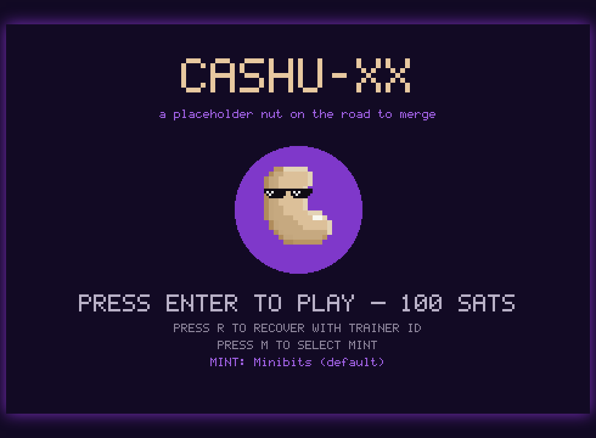

# Cashu-XX

<p align="center">
  
</p>

An 8-bit browser RPG about getting merged into the Cashu spec.

You are **XX** — a nut with sunglasses and no NUT number, a walking placeholder
(`NUT-XX`). Pay a 100-sat invoice to enter **Nussstadt**, a Berlin-inspired city
populated by the Cashu ecosystem (Rusty the cdk crab, Coco the cashu-ts coconut,
Pip the nutshell python, DJ Mac the macadamia, Kimi from the red team, and
Professor Hickory). Follow the real [CONTRIBUTING.md](https://github.com/cashubtc/nuts/blob/main/CONTRIBUTING.md)
process — open an issue, get reviews, land implementation PRs — and get merged
as a new NUT.

Your 100 sats come back as **10 real cashu tokens** (10 sats each), earned at
milestones and found hidden around the city. Scan them with any cashu wallet.

## Screenshots

| Title & payment | Nussstadt |
| --- | --- |
|  |  |

| Reading the signs | Hickory's lab |
| --- | --- |
|  |  |

## Status

v1 complete (P0–P5) — real Cashu mint integration: pay 100 sats, play, claim
100 sats back. The wallet defaults to the [Minibits mint](https://minibits.cash)
and can be pointed at another mint from an in-game **mint directory** (NUT-06).
See [`docs/ROADMAP.md`](docs/ROADMAP.md).

## Docs

| Doc | Contents |
| --- | --- |
| [docs/GDD.md](docs/GDD.md) | Game design: story, characters, world, challenges, token economy |
| [docs/ARCHITECTURE.md](docs/ARCHITECTURE.md) | Client/server design, wallet flows, QR entry & redemption, art pipeline |
| [docs/ROADMAP.md](docs/ROADMAP.md) | Build phases P0–P5 |

## The loop

1. **Pick a mint (optional)** — from the title screen, `M` opens the mint
   directory: a curated list of public mints, each checked live for NUT-06 info
   and input fees, plus any mint URL you paste in. The default is Minibits.
2. **Pay** — scan a 100-sat Lightning invoice (any LN wallet works). Your
   **Trainer ID** (claim code) appears on the payment screen — save it.
3. **Play** — ~30 min of quests modeled on the NUT contribution process.
4. **Cash out** — when you're done, Prof. Hickory bundles every token you found
   into **one cashu token**, shown as a single QR on the ending screen: scan it
   with any cashu wallet (or press C to copy it). Prefer Lightning? Press L and
   give a Lightning address or invoice; the token is taken back and melted
   instead. You get 10 sats per token found; unfound tokens stay with the mint.

Ecash defaults to the [Minibits mint](https://minibits.cash) (best-effort beta
mint — small amounts only). Mints that charge an input fee are allowed.

Under the hood the 100 sats are minted into the server wallet and the server
keeps a per-session ledger of found tokens; nothing is pre-split. The payout is
one send of exactly the earned amount, encoded as a V4 `cashuB` token without
DLEQ proofs (a handful of proofs, ~700 chars, fits a scannable QR).

## Stack

- **Client:** Phaser 4 · TypeScript · Vite
- **Server:** Node · Fastify · SQLite · [`@cashu/coco-core`](https://github.com/cashubtc/coco) + `@cashu/coco-sqlite`
- **Art:** hand-authored GBC pixel art as code ([`client/src/art/`](client/src/art/)), inspired by classic 8-bit town RPGs; XX is drawn from the Cashu logo
- **Audio:** 8-bit generated tracks + SFX

## Development

```bash
npm install
npm run dev        # mock wallet — free  (client :5173, server :8787)
npm run dev:real   # real Minibits mint — real sats!
npm test           # vitest (wallet + API + world data)
```

With `dev:real`: pay the 100-sat invoice with any Lightning wallet, play, then
see Prof. Hickory for your combined token. `MINT_URL` sets the default mint
(players can switch per run from the directory). The server logs
`[timing] deposit quote …` per invoice; it should be one mint round trip
(~0.3–0.6 s).

Controls: arrows/WASD move · Z talk/read · X menu · N night · text speed and
sound in the menu's SETTINGS page.

## Operator: the server wallet

All entry sats live in one pooled wallet; `balance` shows what open sessions are
still owed. Unfound tokens' sats stay in the pool. To sweep the surplus into a
token for your own wallet:

```bash
npm run wallet -w server -- balance    # read-only overview
npm run wallet -w server -- withdraw   # dry run
npm run wallet -w server -- withdraw --yes
```

Stop the game server first; the tool refuses to run if it is up (two SQLite
writers would corrupt the wallet). It backs up the databases to
`server/data/backups/` and writes one token per mint to
`server/data/withdrawals/`. It keeps back what open sessions are owed (pass
`--all` to sweep everything) and never touches issued player payout tokens.

Wallets from before the ledger model (live per-milestone sends, leaked
`inflight` proofs, fragmented 2/4-sat proofs) are repaired with:

```bash
npm run wallet -w server -- cleanup        # dry run
npm run wallet -w server -- cleanup --yes  # reclaim old sends, release orphaned proofs, consolidate
```

If a mint took a payment but never issued the proofs (e.g. an older coco rejected
an empty `pubkey` as an ownership conflict), recover those sats first:

```bash
npm run wallet -w server -- recycle    # re-issues paid-but-unissued quotes
```

All commands are idempotent; re-running is safe.

## Credits & licenses

- Game design, code, and pixel pipeline: this repo (MIT or TBD).
- In-game pixel art is hand-authored in code (`client/src/art/`). Key art was
  generated via fal.ai; music and jingles generated with
  Stable Audio 2.5; all generation provenance in
  [`assets/manifest.json`](assets/manifest.json).
- SFX "Videogame Menu Select" by Fupicat and "Wooden door open-close" by Ryding
  ([Freesound](https://freesound.org)) — both **CC0 1.0**.
- Cashu protocol: [cashubtc/nuts](https://github.com/cashubtc/nuts).
