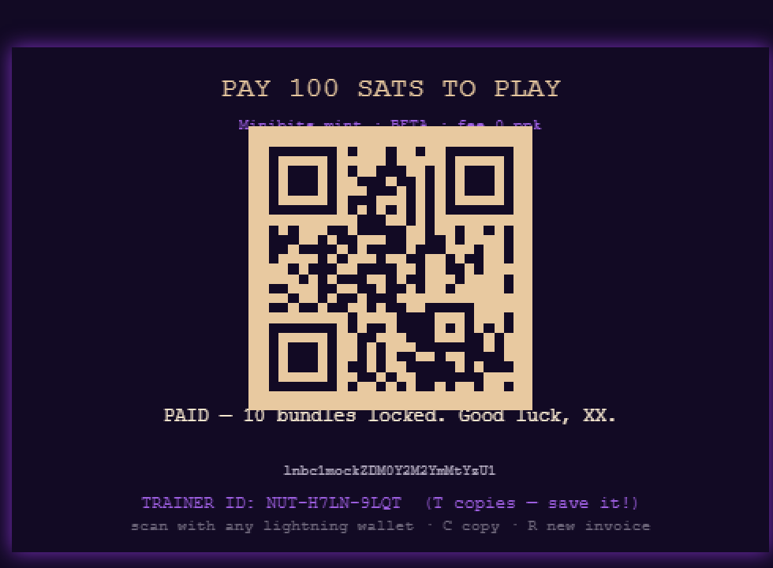
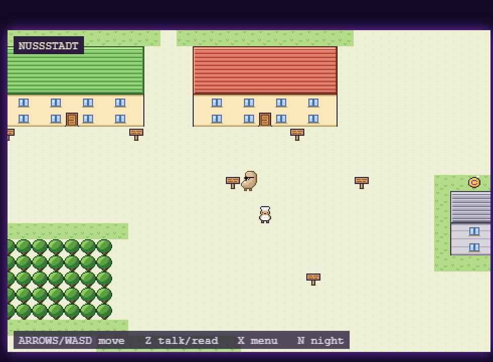
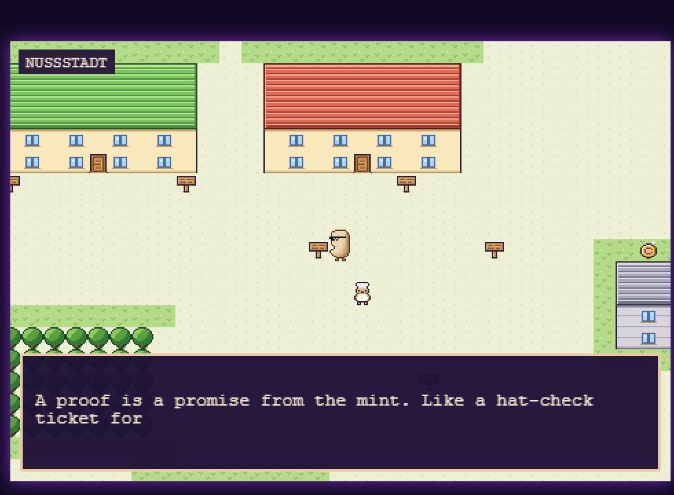
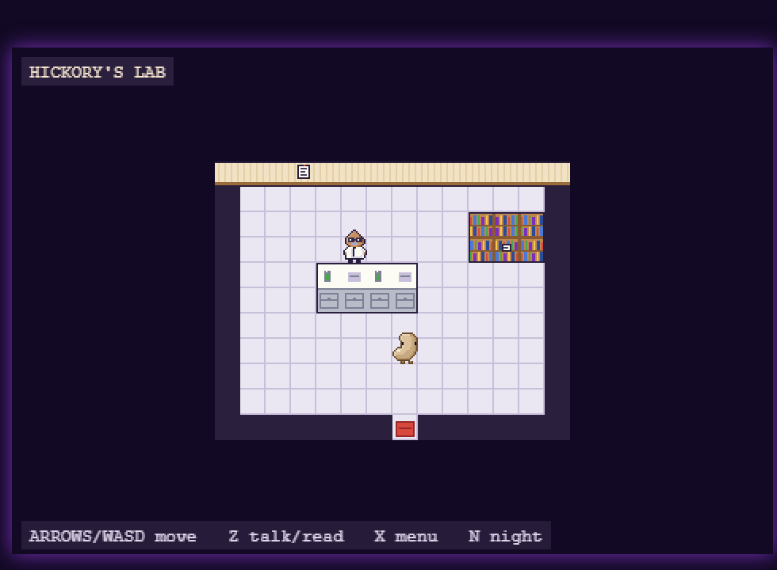

# Cashu-XX

<p align="center">
  
</p>

A Pokémon Crystal–style 8-bit browser RPG about getting merged into the Cashu spec.

You are **XX** — a nut with sunglasses and no NUT number, a walking placeholder
(`NUT-XX`). Pay a 100-sat invoice to enter **Nussstadt**, a Berlin-inspired city
populated by the Cashu ecosystem (Rusty the cdk crab, Coco the cashu-ts coconut,
Pip the nutshell python, DJ Mac the macadamia, Kimi from the red team, and
Professor Hickory). Follow the real [CONTRIBUTING.md](https://github.com/cashubtc/nuts/blob/main/CONTRIBUTING.md)
process — open an issue, get reviews, land implementation PRs — and get merged
as a new NUT.

Your 100 sats come back as **10 real cashu tokens** (10 sats each), earned at
milestones and found hidden around the city. Scan them with any cashu wallet.

## Screenshots

| Title & payment | Nussstadt |
| --- | --- |
|  |  |

| Reading the signs | Hickory's lab |
| --- | --- |
|  |  |

Promo clip: [docs/media/promo.mp4](docs/media/promo.mp4)

## Status

v1 complete (P0–P5) — real Minibits mint integration: pay 100 sats, play, claim
100 sats back. See [`docs/ROADMAP.md`](docs/ROADMAP.md).

## Docs

| Doc | Contents |
| --- | --- |
| [docs/GDD.md](docs/GDD.md) | Game design: story, characters, world, challenges, token economy |
| [docs/ARCHITECTURE.md](docs/ARCHITECTURE.md) | Client/server design, wallet flows, QR entry & redemption, art pipeline |
| [docs/ROADMAP.md](docs/ROADMAP.md) | Build phases P0–P5 |

## The loop

1. **Pay** — scan a 100-sat Lightning invoice (any LN wallet works). Your
   **Trainer ID** (claim code) appears on the payment screen — save it.
2. **Play** — ~30 min of quests modeled on the NUT contribution process.
3. **Claim** — 10 tokens × 10 sats, each a `cashuA` QR any cashu wallet can take
   (the receptionist at Minibits HQ re-displays any of them). The game never
   takes a cut.

Ecash on the [Minibits mint](https://minibits.cash) (best-effort beta mint —
small amounts only).

## Stack

- **Client:** Phaser 4 · TypeScript · Vite
- **Server:** Node · Fastify · SQLite · [`@cashu/coco-core`](https://github.com/cashubtc/coco) + `@cashu/coco-sqlite`
- **Art:** hand-authored GBC pixel art as code ([`client/src/art/`](client/src/art/)), inspired by New Bark Town; XX is drawn from the Cashu logo
- **Audio:** 8-bit generated tracks + SFX

## Development

```bash
npm install
npm run dev        # mock wallet — free  (client :5173, server :8787)
npm run dev:real   # real Minibits mint — real sats!
npm test           # vitest (wallet + API + world data)
```

With `dev:real`: pay the 100-sat invoice with any Lightning wallet, play, and
claim 10 × 10-sat cashu tokens with any cashu wallet.

Controls: arrows/WASD move · Z talk/read · X menu · N night · text speed and
sound in the menu's SETTINGS page.

## Operator: withdrawing unclaimed ecash

Unclaimed game tokens stay in the server wallet (as pending sends in coco). To
sweep everything unredeemed into one token for your own wallet:

```bash
npm run wallet -w server -- balance    # read-only overview
npm run wallet -w server -- withdraw   # dry run
npm run wallet -w server -- withdraw --yes
```

Stop the game server first; the tool refuses to run if it is up (two SQLite
writers would corrupt the wallet). It backs up the databases to
`server/data/backups/`, reclaims every unredeemed token, marks those game tokens
`reclaimed` (players then get "the operator withdrew the sats" instead of a dead
token), and writes the single token to `server/data/withdrawals/`.

Expect it to take a few minutes: coco re-checks every send against the mint on
startup, and the mint API is rate-limited. Re-running is safe — it is idempotent
and reclaims a previous withdrawal token too, so you always end up with one.

## Credits & licenses

- Game design, code, and pixel pipeline: this repo (MIT or TBD).
- In-game pixel art is hand-authored in code (`client/src/art/`). Key art and the promo
  clip were generated via fal.ai; music and jingles generated with
  Stable Audio 2.5; all generation provenance in
  [`assets/manifest.json`](assets/manifest.json).
- SFX "Videogame Menu Select" by Fupicat and "Wooden door open-close" by Ryding
  ([Freesound](https://freesound.org)) — both **CC0 1.0**.
- Cashu protocol: [cashubtc/nuts](https://github.com/cashubtc/nuts).
